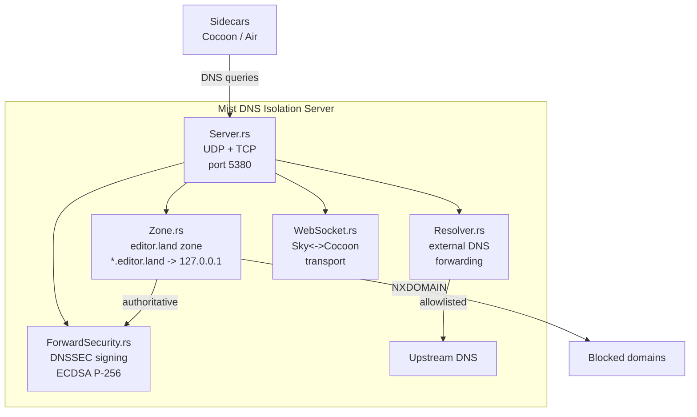

<table>
	<tr>
		<td colspan="1">
			<h3 align="center">
				<picture>
					<source media="(prefers-color-scheme: dark)" srcset="https://editor.land/Dark/Image/GitHub/Land.svg">
					<source media="(prefers-color-scheme: light)" srcset="https://editor.land/Image/GitHub/Land.svg">
					
				</picture>
			</h3>
		</td>
		<td colspan="3" valign="top">
			<h3 align="center"> Mist 🌫️</h3>
		</td>
	</tr>
</table>

---

# **Mist** 🌫️ Architecture

`Mist` is a local DNS server that provides network isolation for `Land`'s
sidecar processes:

- Runs an authoritative DNS server for the `editor.land` zone
- Resolves all subdomains to `127.0.0.1`
- Implements forward allowlisting for controlled external domain access

---

## Table of Contents

1. [Overview](#overview)
2. [Architecture](#architecture)
3. [DNS Zone Configuration](#dns-zone-configuration)
4. [Forward Allowlisting](#forward-allowlisting)
5. [DNSSEC](#dnssec)
6. [WebSocket Transport](#websocket-transport)
7. [Startup Sequence](#startup-sequence)
8. [Related Documentation](#related-documentation)

---



## Overview 📋

`Mist` runs a local `Hickory DNS` server authoritative for the `editor.land`
zone on loopback (port 5380):

- Provides network isolation for sidecar processes (`Cocoon`, `Air`)
- Prevents them from resolving arbitrary external hosts without explicit
  allowlisting

| Attribute    | Value                                               |
| ------------ | --------------------------------------------------- |
| Language     | `Rust` (edition 2024)                               |
| Crate type   | Library + Binary                                    |
| DNS library  | `hickory-server`, `hickory-proto`, `hickory-client` |
| Port         | 5380 (UDP + TCP)                                    |
| Dependencies | `Common`, `ring`, `tokio`, `reqwest`                |
| Consumed by  | `Mountain`, `SideCar`                               |

---

## Architecture 🏗️

```
+----------------------------------------------------------+
|                        Mist                               |
|                                                           |
|  +------------------+  +------------------+               |
|  | Server.rs        |  | Zone.rs          |               |
||  | UDP + TCP DNS    |  | editor.land zone |               |
|  | listener         |  | resolution logic |               |
|  +------------------+  +------------------+               |
|                                                           |
|  +------------------+  +------------------+               |
|  | Resolver.rs      |  | ForwardSecurity  |               |
|  | External DNS     |  | .rs              |               |
|  | forwarding       |  | DNSSEC signing   |               |
|  +------------------+  +------------------+               |
|                                                           |
|  +------------------+                                     |
|  | WebSocket.rs     |                                     |
|  | WebSocket        |                                     |
|  | transport for    |                                     |
|  | Sky<->Cocoon     |                                     |
|  +------------------+                                     |
+----------------------------------------------------------+
```

### Module Map 🗺️

| Path                        | Purpose                                                |
| --------------------------- | ------------------------------------------------------ |
| `Source/Server.rs`          | UDP and TCP DNS listener, query dispatch               |
| `Source/Zone.rs`            | `editor.land` zone configuration and record generation |
| `Source/Resolver.rs`        | External DNS forwarding for allowlisted domains        |
| `Source/ForwardSecurity.rs` | DNSSEC signing with ECDSA P-256                        |
| `Source/WebSocket.rs`       | WebSocket transport for `Sky`<->`Cocoon` communication |
| `Source/lib.rs`             | Library root                                           |

---

## DNS Zone Configuration 🌐

`Mist` serves the `editor.land` zone with the following configuration:

```
editor.land.  IN SOA  localhost. root.editor.land. (
    2026010100 ; serial
    3600       ; refresh
    900        ; retry
    86400      ; expire
    60         ; minimum TTL
)

*.editor.land.  IN A  127.0.0.1
```

All `*.editor.land` subdomains resolve to `127.0.0.1`:

- Ensures sidecar processes communicate only over localhost
- Prevents any sidecar process from exfiltrating data through DNS
- Provides a first line of defense against compromised extension code

### Resolution Rules 📋

| Query Pattern      | Response                | Behavior                        |
| ------------------ | ----------------------- | ------------------------------- |
| `*.editor.land`    | `A 127.0.0.1`           | Authoritative answer from zone  |
| Allowlisted domain | Forward to upstream DNS | Pass-through to system resolver |
| All other domains  | `NXDOMAIN`              | Refused                         |

---

## Forward Allowlisting 📝

`Mist` maintains a configurable allowlist of trusted external domains that
sidecar processes may resolve:

| Domain                         | Purpose                        | Status              |
| ------------------------------ | ------------------------------ | ------------------- |
| `marketplace.visualstudio.com` | Extension downloads            | Allowlisted         |
| `update.editor.land`           | Application update server      | Allowlisted         |
| `api.posthog.com`              | Telemetry (when enabled)       | Allowlisted         |
| `www.google-analytics.com`     | Usage analytics (when enabled) | Allowlisted         |
| All unlisted domains           | Blocked                        | `NXDOMAIN` response |

The allowlist is loaded from a configuration file at startup and can be updated
at runtime.

---

## DNSSEC 🔐

`Mist` supports DNSSEC with ECDSA P-256 signing for the `editor.land` zone:

| Aspect         | Detail                               |
| -------------- | ------------------------------------ |
| Algorithm      | ECDSA P-256 (algorithm 13)           |
| Key generation | First-run automatic generation       |
| Key storage    | Application data directory           |
| RRSIG records  | Automatically generated on zone load |
| Validation     | N/A (authoritative server)           |

Signing keys are generated on first run and cached for subsequent starts. Zone
data is signed with RRSIG records before responding to queries that request
DNSSEC.

---

## WebSocket Transport 🔌

In addition to DNS serving, `Mist` provides a WebSocket transport layer for
`Sky`<->`Cocoon` communication:

- Used for real-time data streaming between the UI layer and the extension host
- Used when `gRPC` is unavailable or inappropriate for the communication pattern

```
Sky UI (WebView)
    |
    | WebSocket
    v
Mist WebSocket.rs
    |
    | Message routing
    v
Cocoon (Node.js extension host)
```

---

## Startup Sequence 🚀

```
1. Mountain spawns Mist binary
   - Port 5380 is bound (UDP + TCP)
   - System DNS configuration may be updated to point to loopback

2. Mist opens UDP and TCP listeners on port 5380
   - Hickory DNS server initializes
   - editor.land zone is loaded from configuration
   - DNSSEC signing keys are loaded or generated

3. DNS resolution begins
   - *.editor.land queries answered authoritatively
   - Allowlisted domains forwarded to system resolver
   - All other domains return NXDOMAIN

4. WebSocket server starts (optional)
   - Bound to configured WebSocket port
   - Accepts connections from Sky and Cocoon
```

---

## Related Documentation 📚

- [Air](https://github.com/CodeEditorLand/Air/tree/Current/Documentation/GitHub/Architecture.md) -
  Background daemon (DNS consumer)
- [Mountain](https://github.com/CodeEditorLand/Mountain/tree/Current/Documentation/GitHub/Architecture.md) -
  Main backend (DNS consumer)
- [SideCar](https://github.com/CodeEditorLand/SideCar/tree/Current/Documentation/GitHub/Architecture.md) -
  Vendored runtimes (DNS consumer)
- [RustInfrastructure](https://github.com/CodeEditorLand/Land/tree/Current/Documentation/GitHub/RustInfrastructure.md) -
  `Rust` backend components

---

## Shim Compatibility

| 🟠 Low-Level Shim                              | 🔵 Coverage Shim                   |
| ---------------------------------------------- | ---------------------------------- |
| Tier: `TierShim=Own\|Preempt`                  | Tier: `TierShim=Proxy\|Replace`    |
| Engine prototype hooks                         | Service routing + audit            |
| Error, Emitter, Cancel, Dispose, Async, Timing | IPC SwallowMap, DI proxy, AuditLog |

> This Element supports the Land deep-shim interception system. The shim
> intercepts VS Code engine events at both the JavaScript prototype level (🟠
> orange) and the application service level (🔵 blue). Gated behind `TierShim`
> env var (default: `None` - zero overhead). See the
> [Shim documentation](/doc/low-level-shim).

**Shim Modules:** No shim-specific modules - events routed through
`Wind`/`Mountain`/`Cocoon`.

---

**Project Maintainers:** Source Open
([Source/Open@editor.land](mailto:Source/Open@editor.land)) |
[GitHub Repository](https://github.com/CodeEditorLand/Mist) |
[Report an Issue](https://github.com/CodeEditorLand/Mist/issues)
