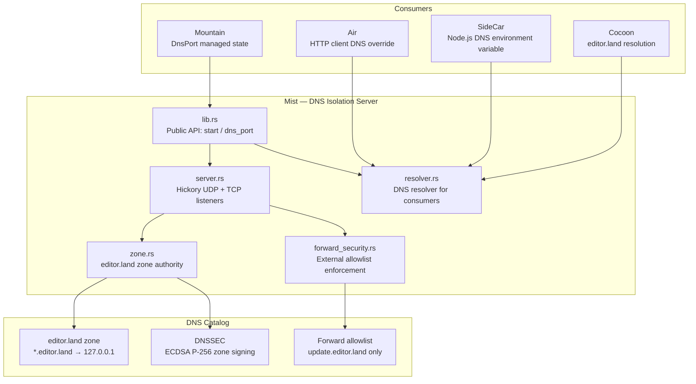
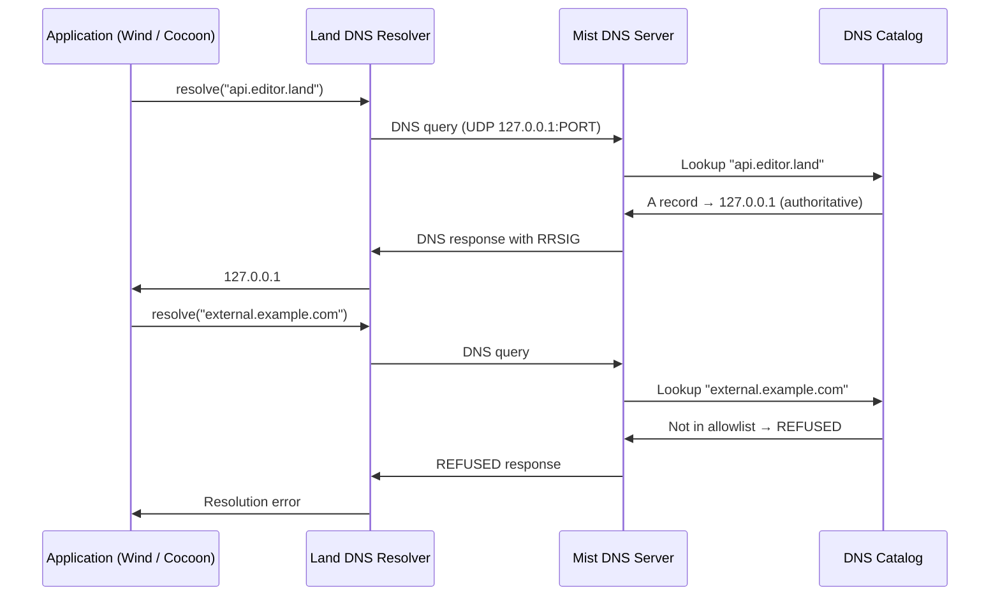

# Mist — Deep Dive

This document provides the technical foundation for the Mist DNS isolation layer
within the Land ecosystem. **Mist** operates a local authoritative DNS server
for the `editor.land` zone, ensuring all private network communication stays on
loopback and preventing sidecars from reaching unauthorized external hosts.

---

## Architecture

Mist is a Rust library built on Hickory DNS. It exposes a public API for
starting the server, querying the bound port, and constructing resolvers. The
DNS catalog contains two zones: an authoritative zone for `editor.land` and a
restricted forward allowlist for external queries.

---

## Key Modules

| Path                         | Description                                                                   |
| :--------------------------- | :---------------------------------------------------------------------------- |
| `Source/lib.rs`              | Public library API: `start(port)`, `dns_port()`, module re-exports            |
| `Source/server.rs`           | Hickory DNS server: UDP/TCP socket binding, catalog wiring, async accept loop |
| `Source/zone.rs`             | `editor.land` zone configuration: SOA, A records, wildcard resolution         |
| `Source/resolver.rs`         | `LandDnsResolver` — DNS client pointed at the local server for consumer use   |
| `Source/forward_security.rs` | Forward allowlist: rejects external queries not on the approved list          |
| `tests/integration.rs`       | Integration tests: zone resolution, DNSSEC verification, forward blocking     |

---

## Data Flow

**Startup sequence:**

1. Mountain calls `Mist::start(5380)` during initialization.
2. Mist attempts to bind to port 5380; if unavailable, `portpicker` selects an
   alternative.
3. The bound port is stored in Mountain's `DnsPort` managed Tauri state.
4. Mountain passes the port to Air and SideCar so they configure their DNS
   clients accordingly.

---

## Integration Points

| Connecting Element | Direction         | Mechanism                | Description                                                                                       |
| :----------------- | :---------------- | :----------------------- | :------------------------------------------------------------------------------------------------ |
| **Mountain**       | Consumer          | `Mist::start()` Rust API | Mountain starts Mist and stores the port in `DnsPort` managed state                               |
| **Air**            | Consumer          | `LandDnsResolver`        | Air configures its `reqwest` HTTP client to use the local resolver                                |
| **SideCar**        | Consumer          | Environment variable     | SideCar passes the DNS port to spawned Node.js processes via `NODE_EXTRA_CA_CERTS` / DNS override |
| **Cocoon**         | Indirect consumer | Node.js DNS override     | Cocoon resolves `cocoon.editor.land` and Mountain gRPC addresses through Mist                     |

---

## Configuration

| Parameter          | Value                | Description                                                  |
| :----------------- | :------------------- | :----------------------------------------------------------- |
| Preferred port     | `5380`               | Primary bind port; falls back to any available port if taken |
| Bind address       | `127.0.0.1`          | Loopback only — no external interface exposure               |
| Authoritative zone | `editor.land`        | All subdomains resolve to `127.0.0.1`                        |
| Forward allowlist  | `update.editor.land` | Only this domain may be resolved externally                  |
| DNSSEC algorithm   | ECDSA P-256          | Zone signing key algorithm                                   |
| Transport          | UDP + TCP            | Hickory serves both; clients may use either                  |

DNSSEC signing is performed at zone load time. The DNSKEY and RRSIG records are
included in responses to clients that request DNSSEC data (`DO` bit set).
