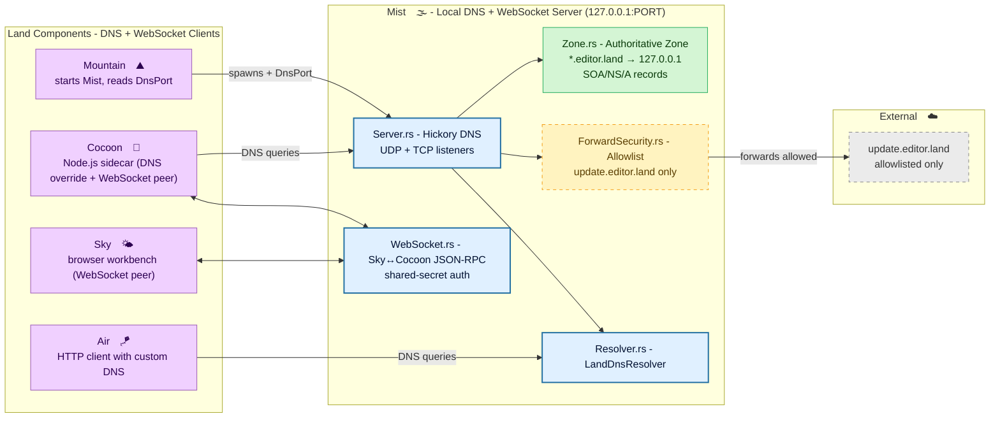

# **Mist**&#x2001;🌫️

<table>
	<tr>
		<td>
			<a href="https://GitHub.Com/CodeEditorLand/Mist" target="_blank">
				<picture>
					<source media="(prefers-color-scheme: dark)" srcset="https://img.shields.io/github/last-commit/CodeEditorLand/Mist?label=Update&color=black&labelColor=black&logoColor=white&logoWidth=0" />
					<source media="(prefers-color-scheme: light)" srcset="https://img.shields.io/github/last-commit/CodeEditorLand/Mist?label=Update&color=white&labelColor=white&logoColor=black&logoWidth=0" />
					
				</picture>
			</a>
			<br />
			<a href="https://GitHub.Com/CodeEditorLand/Mist" target="_blank">
				<picture>
					<source media="(prefers-color-scheme: dark)" srcset="https://img.shields.io/github/issues/CodeEditorLand/Mist?label=Issue&color=black&labelColor=black&logoColor=white&logoWidth=0" />
					<source media="(prefers-color-scheme: light)" srcset="https://img.shields.io/github/issues/CodeEditorLand/Mist?label=Issue&color=white&labelColor=white&logoColor=black&logoWidth=0" />
					
				</picture>
			</a>
		</td>
		<td>
			<a href="https://github.com/CodeEditorLand/Mist" target="_blank">
				<picture>
					<source media="(prefers-color-scheme: dark)" srcset="https://img.shields.io/github/stars/CodeEditorLand/Mist?style=flat&label=Star&logo=github&color=black&labelColor=black&logoColor=white&logoWidth=0" />
					<source media="(prefers-color-scheme: light)" srcset="https://img.shields.io/github/stars/CodeEditorLand/Mist?style=flat&label=Star&logo=github&color=white&labelColor=white&logoColor=black&logoWidth=0" />
					
				</picture>
			</a>
			<br />
			<a href="https://GitHub.Com/CodeEditorLand/Mist" target="_blank">
				<picture>
					<source media="(prefers-color-scheme: dark)" srcset="https://img.shields.io/github/downloads/CodeEditorLand/Mist/total?label=Download&color=black&labelColor=black&logoColor=white&logoWidth=0" />
					<source media="(prefers-color-scheme: light)" srcset="https://img.shields.io/github/downloads/CodeEditorLand/Mist/total?label=Download&color=white&labelColor=white&logoColor=black&logoWidth=0" />
					
				</picture>
			</a>
		</td>
	</tr>
</table>

DNS isolation for the `editor.land` private network.

> **Development environments that communicate over the public internet expose
> services to unnecessary risk. DNS resolution for local services goes through
> external resolvers, leaking information about the development setup.**

_"Nothing leaks to the public internet. A clean network boundary between the
editor and the outside world."_

[](https://github.com/CodeEditorLand/Mist/tree/Current/LICENSE)
[](https://www.rust-lang.org/) [](https://crates.io/crates/Mist)
[](https://www.rust-lang.org/) [](https://www.rust-lang.org/)

**[Rust API Documentation](https://rust.documentation.mist.editor.land/)**&#x2001;📖

---

## Overview

**Mist** provides DNS isolation and private network resolution for the **Land**
Code Editor. It creates a secure DNS sandbox that resolves all `*.editor.land`
domains locally to `127.0.0.1`, ensuring that all private network communication
remains local and secure. External DNS queries are restricted to a strict
allowlist, preventing sidecars from accessing arbitrary external hosts.

Editor components need to discover each other on the private network, but
standard DNS resolution leaks queries to external resolvers. Mist solves this by
running a local authoritative DNS server for the `editor.land` zone - every
query stays on the machine, and nothing escapes to the public internet.

**Mist is engineered to:**

1. **Provide Private DNS Resolution** - Operate a local DNS server authoritative
   for the `editor.land` zone, resolving all subdomains to `127.0.0.1` for
   secure local communication.
2. **Enforce Forward Security** - Implement a forward allowlist that only
   permits DNS resolution to specific, trusted external domains (e.g.,
   `update.editor.land`).
3. **Bridge Sky**&#x2001;🌌&#x2001;**and
   Cocoon**&#x2001;🦋&#x2001;**Directly** - Run a local-first `JSON`-RPC
   `WebSocket` transport (`Source/WebSocket.rs`) with shared-secret
   authentication, removing the Tauri-invoke + `gRPC` double hop for
   high-frequency extension-API traffic.
4. **Enable Sidecar Isolation** - Allow `Node.js` sidecars (like
   **Cocoon**&#x2001;🦋) to use the local DNS server via a custom DNS override,
   ensuring they cannot access arbitrary external hosts.

---

## Key Features&#x2001;🔒

**Private DNS Zone** - Authoritative zone for `*.editor.land` domains. All
subdomains resolve to `127.0.0.1`, creating a fully isolated private network for
the editor's internal services. No DNS queries ever leave the machine.

**Forward Security** - Allowlist-based DNS forwarding prevents sidecars from
reaching arbitrary external hosts. Only explicitly trusted domains (such as
`update.editor.land`) can be resolved externally. All other queries are refused
by default.

**Dynamic Port Allocation** - Automatically finds available ports using
`portpicker`, avoiding port conflicts with other services. Prefers a
configurable starting port and falls back to system-assigned ports when needed.

**WebSocket Transport** - `Source/WebSocket.rs` implements a local-first
`JSON`-RPC channel for the direct Sky↔Cocoon path, replacing the Tauri-invoke +
`Mountain`&#x2001;⛰️ `gRPC` double hop for the ~95% of `IPC` traffic that
is extension-API calls. Every spawn gets a random 32-byte shared secret,
presented by clients via the `X-Land-Secret` header, a `?secret=` query
parameter, or a `Sec-WebSocket-Protocol` entry (browsers cannot set custom
upgrade headers); connections presenting none of the three are rejected with
`403 Forbidden`. Reconnect uses exponential backoff (100ms → 5s cap, 30s
give-up).

**Loopback Binding** - The DNS server binds exclusively to `127.0.0.1`, ensuring
no external host can query the private DNS server. Combined with the forward
allowlist, this creates a complete network boundary.

---

## Core Architecture Principles&#x2001;🏗️

| Principle                   | Description                                                                                                                                                     | Key Components                          |
| --------------------------- | --------------------------------------------------------------------------------------------------------------------------------------------------------------- | --------------------------------------- |
| **Network Isolation**       | All `editor.land` DNS resolution stays local. The server binds to `127.0.0.1` only, and external queries require explicit allowlisting.                         | `Server`, `ForwardSecurity`             |
| **Authenticated Transport** | The `WebSocket` `JSON`-RPC channel requires a per-spawn shared secret on every upgrade request; connections without it are refused before any message is read.  | `WebSocket`, `SharedSecret`             |
| **Minimal Surface**         | A flat module structure with no unnecessary abstractions. Each module has a single, well-defined responsibility with clear public APIs.                         | `Library`, `Server`, `Zone`, `Resolver` |
| **Composability**           | Independent DNS resolver for use by other Land components. Any consumer can create a resolver pointed at the local DNS server without additional configuration. | `Resolver`, `LandDnsResolver`           |

---

## System Architecture



**Connection paths:**

| Path                                | Protocol                           | Use Case                                                    |
| ----------------------------------- | ---------------------------------- | ----------------------------------------------------------- |
| Mountain&#x2001;⛰️ → Mist&#x2001;🌫️ | Process spawn + port handoff       | Application initialization, reads `DnsPort` managed state   |
| Cocoon&#x2001;🦋 → Mist&#x2001;🌫️   | DNS over UDP/TCP to `127.0.0.1`    | `Node.js` sidecar DNS resolution for `editor.land` domains  |
| Air&#x2001;🪁 → Mist&#x2001;🌫️      | `LandDnsResolver` (Hickory client) | HTTP client DNS configured to use local resolver            |
| Cocoon&#x2001;🦋 ↔ Mist&#x2001;🌫️   | `JSON`-RPC over `WebSocket`        | Direct Sky↔Cocoon extension-API traffic, shared-secret auth |
| Sky&#x2001;🌌 ↔ Mist&#x2001;🌫️      | `JSON`-RPC over `WebSocket`        | Browser workbench side of the same direct transport         |
| Mist&#x2001;🌫️ → External           | UDP DNS (allowlisted only)         | Forwarding queries for `update.editor.land`                 |

---

## Key Components

| Component           | Path                        | Description                                                                                                   |
| ------------------- | --------------------------- | ------------------------------------------------------------------------------------------------------------- |
| Library Entry       | `Source/Library.rs`         | Main library entry point, exports public API and manages DNS server state.                                    |
| DNS Server          | `Source/Server.rs`          | DNS server implementation using Hickory, handles UDP/TCP listeners and catalog management.                    |
| Zone Configuration  | `Source/Zone.rs`            | DNS zone configuration for `editor.land`, including record (SOA/NS/A) definitions and authority creation.     |
| DNS Resolver        | `Source/Resolver.rs`        | `LandDnsResolver` for `reqwest` DNS override, routing `*.editor.land` to loopback; `TokioResolver` is a stub. |
| Forward Security    | `Source/ForwardSecurity.rs` | Forward allowlist management, restricts which external domains can be resolved.                               |
| WebSocket Transport | `Source/WebSocket.rs`       | `JSON`-RPC `WebSocket` server/client for the direct Sky↔Cocoon path, with shared-secret auth and reconnect.   |

---

## Project Structure&#x2001;🗺️

```
Mist/
├── Source/
│   ├── Library.rs              # Library root, DNS server lifecycle
│   ├── Server.rs               # Hickory DNS server (UDP/TCP listeners)
│   ├── Zone.rs                 # Authoritative editor.land zone (SOA/NS/A)
│   ├── Resolver.rs             # LandDnsResolver for consumer use
│   ├── ForwardSecurity.rs      # Allowlist-based forward DNS
│   └── WebSocket.rs            # JSON-RPC over WebSocket transport (Sky↔Cocoon)
├── tests/
│   └── integration.rs          # Integration test suite
├── Documentation/
│   ├── GitHub/
│   │   ├── Architecture.md     # Internal module design
│   │   └── DeepDive.md         # In-depth technical details
│   └── Rust/
│       └── doc/                # Cargo doc output
└── Cargo.toml
```

---

## In the Land Project

**Mist** provides the DNS isolation that secures the Land private network. All
`*.editor.land` domains resolve to `127.0.0.1`, preventing external network
leakage. External DNS queries are restricted to a strict allowlist.

**Mist** is part of the networking/IPC connectivity stack alongside
**Air**&#x2001;🪁 (background daemon, uses Mist's DNS resolver for its HTTP
client) and **Vine**&#x2001;🌿 (`gRPC` protocol layer).

### Integration

| Consumer               | How Mist is Used                                                                                                                   |
| ---------------------- | ---------------------------------------------------------------------------------------------------------------------------------- |
| **Mountain**&#x2001;⛰️ | Starts the DNS server during application initialization and provides the port to other components via the `DnsPort` managed state. |
| **Air**&#x2001;🪁      | Uses the DNS server for secure HTTP requests, configuring HTTP clients to use the local DNS resolver.                              |
| **SideCar**&#x2001;🚃  | Spawns `Node.js` sidecars with DNS override configuration, ensuring all DNS queries go through the local server.                   |
| **Cocoon**&#x2001;🦋   | The `Node.js` extension host can resolve `editor.land` domains via the local DNS server for `gRPC` communication with Mountain.    |

### DNS Zone Configuration

**Authoritative Zone: `editor.land`** - All subdomains of `editor.land` resolve
to `127.0.0.1`:

- `code.editor.land` → `127.0.0.1`
- `api.editor.land` → `127.0.0.1`
- `*.editor.land` → `127.0.0.1`

**Forward Allowlist** - Only allowlisted external domains can be resolved:

- `update.editor.land` - For application updates

All other external queries are refused by default.

**WebSocket Path** - `Source/WebSocket.rs` runs a `JSON`-RPC channel alongside
the DNS server for the direct Sky↔Cocoon path:

- Every spawn generates a random 32-byte `SharedSecret`
- Clients authenticate via `X-Land-Secret` header, `?secret=` query parameter,
  or `Sec-WebSocket-Protocol` entry
- Connections presenting none of the three are rejected with `403 Forbidden`
- Reconnect uses exponential backoff (100ms → 5s cap, gives up after 30s)

---

## Getting Started&#x2001;🚀

### Prerequisites

- **Rust** 1.75 or later
- No system DNS configuration required - Mist binds to `127.0.0.1` only

### Build

```bash
cd Element/Mist
cargo build --release
```

### Test

```bash
# Run all tests
cargo test

# Run integration tests
cargo test --test integration

# Run with logging
RUST_LOG=debug cargo test
```

### As a Library

```rust
use Mist::start;

// Start on preferred port 5380
let Port = Mist::start(5380)?;

// Or let the system select an available port
let Port = Mist::start(0)?;

println!("DNS server running on 127.0.0.1:{}", Port);
```

### Creating a DNS Resolver

```rust
use Mist::resolver::{land_resolver, LandDnsResolver};

// Simple resolver
let Port = Mist::dns_port();
let Resolver = land_resolver(Port);

// Or with explicit interface
let Resolver = LandDnsResolver::new(Port);
```

### Key Dependencies

| Crate               | Purpose                                                        |
| ------------------- | -------------------------------------------------------------- |
| `hickory-server`    | DNS server implementation (`dnssec-ring` feature enabled)      |
| `hickory-proto`     | DNS protocol implementation (`dnssec-ring` feature enabled)    |
| `hickory-client`    | DNS client for resolvers                                       |
| `ring`              | Cryptographic primitives (available for future DNSSEC signing) |
| `tokio`             | Async runtime                                                  |
| `tokio-tungstenite` | `WebSocket` protocol for the Sky↔Cocoon transport              |
| `futures-util`      | Stream/sink combinators for the `WebSocket` server             |
| `hex`               | Hex encoding for the `WebSocket` shared secret                 |
| `anyhow`            | Error handling                                                 |
| `tracing`           | Logging and instrumentation                                    |
| `once_cell`         | Thread-safe lazy initialization                                |
| `portpicker`        | Random port selection                                          |
| `async-trait`       | Async trait support                                            |
| `reqwest`           | HTTP client with DNS integration                               |
| `rand`              | Shared-secret generation                                       |
| `Common`            | Shared workspace types (workspace-internal crate)              |

---

## Security&#x2001;🔒

Mist enforces security at multiple layers:

| Layer                 | Mechanism                                                                                                                                                              |
| --------------------- | ---------------------------------------------------------------------------------------------------------------------------------------------------------------------- |
| **Network isolation** | All `editor.land` domains resolve to `127.0.0.1`, preventing any external network access for private services.                                                         |
| **Forward allowlist** | External DNS queries are restricted to a trusted allowlist, preventing sidecars from accessing arbitrary external hosts.                                               |
| **Loopback binding**  | Both the DNS server and the `WebSocket` server only bind to `127.0.0.1`/loopback, preventing external access.                                                          |
| **WebSocket auth**    | Every spawn's `SharedSecret` (32 random bytes) is required on the upgrade request; unauthenticated connections receive `403 Forbidden` before any RPC message is read. |

---

## Compatibility

Mist is designed to be compatible with:

| Target                 | Integration                                                                                                    |
| ---------------------- | -------------------------------------------------------------------------------------------------------------- |
| **Mountain**&#x2001;⛰️ | Starts the DNS server at initialization and distributes `DnsPort` via managed state                            |
| **Air**&#x2001;🪁      | Uses `LandDnsResolver` as `reqwest` DNS override for secure HTTP requests                                      |
| **Cocoon**&#x2001;🦋   | Resolves `editor.land` domains through the local DNS server for `gRPC` IPC; also a `WebSocket` `JSON`-RPC peer |
| **Sky**&#x2001;🌤️      | Browser workbench peer on the direct `WebSocket` `JSON`-RPC path                                               |
| **SideCar**&#x2001;🚃  | Spawns `Node.js` sidecars with DNS override pointing at the local server                                       |

---

## API Reference

- **[Rust API Documentation](https://rust.documentation.mist.editor.land/)**&#x2001;📖

---

## Related Documentation

- [Architecture Overview](https://github.com/CodeEditorLand/Mist/tree/Current/Documentation/GitHub/Architecture.md)
    - Internal module structure
- [Deep Dive](https://github.com/CodeEditorLand/Mist/tree/Current/Documentation/GitHub/DeepDive.md)
    - In-depth technical details
- [Land Documentation](../../Documentation/GitHub/README.md) - Complete
  documentation index
- **Air**&#x2001;🪁 - Background daemon that consumes Mist for HTTP client DNS -
  [GitHub](https://github.com/CodeEditorLand/Air)
- **Vine**&#x2001;🌿 - `gRPC` protocol layer -
  [GitHub](https://github.com/CodeEditorLand/Vine)
- **Mountain**&#x2001;⛰️ - Main application process -
  [GitHub](https://github.com/CodeEditorLand/Mountain)
- [CHANGELOG](https://github.com/CodeEditorLand/Mist/tree/Current/CHANGELOG.md)
    - Version history

---

## License&#x2001;⚖️

This project is released into the public domain under the **Creative Commons CC0
Universal** license. You are free to use, modify, distribute, and build upon
this work for any purpose, without any restrictions. For the full legal text,
see the [`LICENSE`](https://github.com/CodeEditorLand/Mist/tree/Current/LICENSE)
file.

---

## Changelog&#x2001;📜

Stay updated with our progress! See
[`CHANGELOG.md`](https://github.com/CodeEditorLand/Mist/tree/Current/CHANGELOG.md)
for a history of changes.

---

## Funding & Acknowledgements&#x2001;🙏🏻

**Land**&#x2001;🏞️ is proud to be an open-source endeavor. Our journey is
significantly supported by the organizations and projects that believe in the
future of open-source software.

This project is funded through
[NGI0 Commons Fund](https://NLnet.NL/commonsfund), a fund established by
[NLnet](https://NLnet.NL) with financial support from the European Commission's
[Next Generation Internet](https://ngi.eu) program. Learn more at the
[NLnet project page](https://NLnet.NL/project/Land).

<table>
	<thead>
		<tr>
			<th align="left"><strong>Land</strong></th>
			<th align="left"><strong>PlayForm</strong></th>
			<th align="left"><strong>NLnet</strong></th>
			<th align="left"><strong>NGI0 Commons Fund</strong></th>
		</tr>
	</thead>
	<tbody>
		<tr>
			<td align="left" valign="middle"><a href="https://editor.land"></a></td>
			<td align="left" valign="middle"><a href="https://PlayForm.Cloud"></a></td>
			<td align="left" valign="middle"><a href="https://NLnet.NL"></a></td>
			<td align="left" valign="middle"><a href="https://NLnet.NL/commonsfund"></a></td>
		</tr>
	</tbody>
</table>

---

**Project Maintainers**: Source Open
([Source/Open@editor.land](mailto:Source/Open@editor.land)) |
[GitHub Repository](https://github.com/CodeEditorLand/Mist) |
[Report an Issue](https://github.com/CodeEditorLand/Mist/issues) |
[Security Policy](https://github.com/CodeEditorLand/Mist/security/policy)
