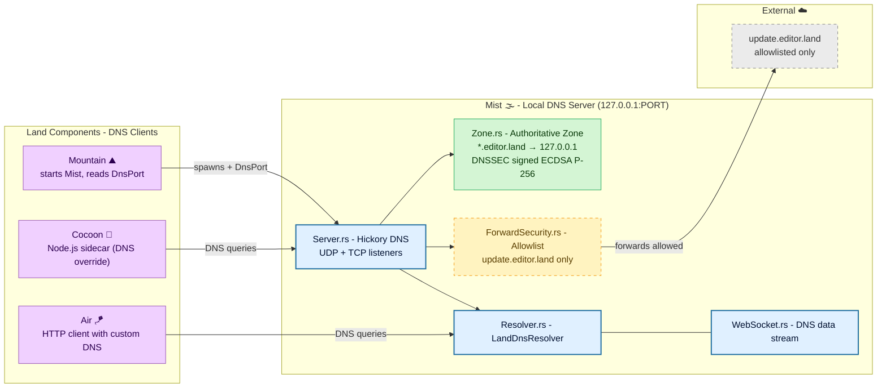

# **Mist** 🌫️

<table>
	<tr>
		<td>
			<a href="https://GitHub.Com/CodeEditorLand/Mist" target="_blank">
				<picture>
					<source media="(prefers-color-scheme: dark)" srcset="https://img.shields.io/github/last-commit/CodeEditorLand/Mist?label=Last-commit&color=black&labelColor=black&logoColor=white&logoWidth=0" />
					<source media="(prefers-color-scheme: light)" srcset="https://img.shields.io/github/last-commit/CodeEditorLand/Mist?label=Last-commit&color=white&labelColor=white&logoColor=black&logoWidth=0" />
					
				</picture>
			</a>
			<br />
			<a href="https://GitHub.Com/CodeEditorLand/Mist" target="_blank">
				<picture>
					<source media="(prefers-color-scheme: dark)" srcset="https://img.shields.io/github/issues/CodeEditorLand/Mist?label=Issues&color=black&labelColor=black&logoColor=white&logoWidth=0" />
					<source media="(prefers-color-scheme: light)" srcset="https://img.shields.io/github/issues/CodeEditorLand/Mist?label=Issues&color=white&labelColor=white&logoColor=black&logoWidth=0" />
					
				</picture>
			</a>
		</td>
		<td>
			<a href="https://github.com/CodeEditorLand/Mist" target="_blank">
				<picture>
					<source media="(prefers-color-scheme: dark)" srcset="https://img.shields.io/github/stars/CodeEditorLand/Mist?style=flat&label=Star&logo=github&color=black&labelColor=black&logoColor=white&logoWidth=0" />
					<source media="(prefers-color-scheme: light)" srcset="https://img.shields.io/github/stars/CodeEditorLand/Mist?style=flat&label=Star&logo=github&color=white&labelColor=white&logoColor=black&logoWidth=0" />
					
				</picture>
			</a>
			<br />
			<a href="https://GitHub.Com/CodeEditorLand/Mist" target="_blank">
				<picture>
					<source media="(prefers-color-scheme: dark)" srcset="https://img.shields.io/github/downloads/CodeEditorLand/Mist?label=Downloads&color=black&labelColor=black&logoColor=white&logoWidth=0" />
					<source media="(prefers-color-scheme: light)" srcset="https://img.shields.io/github/downloads/CodeEditorLand/Mist?label=Downloads&color=white&labelColor=white&logoColor=black&logoWidth=0" />
					
				</picture>
			</a>
		</td>
	</tr>
</table>

DNS isolation for the editor.land private network.

> **Development environments that communicate over the public internet expose
> services to unnecessary risk. DNS resolution for local services goes through
> external resolvers, leaking information about the development setup.**
>
> _"Nothing leaks to the public internet. A clean network boundary between the
> editor and the outside world."_

[](https://github.com/CodeEditorLand/Mist/tree/Current/LICENSE)

**[Rust API Documentation](https://Rust.Documentation.editor.land/Mist/)** 📖

---

## Overview

**Mist** provides DNS isolation and private network resolution for the Land Code
Editor. It creates a secure DNS sandbox that resolves all `*.editor.land`
domains locally to `127.0.0.1`, ensuring that all private network communication
remains local and secure.

**Mist** is engineered to:

1. **Provide Private DNS Resolution:** Operate a local DNS server authoritative
   for the `editor.land` zone, resolving all subdomains to localhost for secure
   local communication.
2. **Enforce Forward Security:** Implement a forward allowlist that only permits
   DNS resolution to specific, trusted external domains (e.g.,
   `update.editor.land`).
3. **Support DNSSEC:** Sign the `editor.land` zone with ECDSA P-256 keys for
   DNSSEC, providing cryptographic assurance of DNS responses.
4. **Enable Sidecar Isolation:** Allow Node.js sidecars (like **Cocoon**) to use
   the local DNS server via a custom DNS override, ensuring they cannot access
   arbitrary external hosts.

## Architecture



## Key Components

| Component           | Path                 | Description                                                                                    |
| ------------------- | -------------------- | ---------------------------------------------------------------------------------------------- |
| Library Entry       | `lib.rs`             | Main library entry point, exports public API and manages DNS server state.                     |
| DNS Server          | `Server.rs`          | DNS server implementation using Hickory, handles UDP/TCP listeners and catalog management.     |
| Zone Configuration  | `Zone.rs`            | DNS zone configuration for `editor.land`, including record definitions and authority creation. |
| DNS Resolver        | `Resolver.rs`        | DNS resolver for use by other components, provides interface to the local DNS server.          |
| Forward Security    | `ForwardSecurity.rs` | Forward allowlist management, restricts which external domains can be resolved.                |
| WebSocket Transport | `WebSocket.rs`       | WebSocket transport layer for real-time DNS data streaming.                                    |

## In the Land Project

**Mist** provides the DNS isolation that secures the Land private network. All
`*.editor.land` domains resolve to `127.0.0.1`, preventing external network
leakage. External DNS queries are restricted to a strict allowlist.

**Mist** is part of the networking/IPC connectivity stack alongside **Air** 🪁
(background daemon, uses Mist's DNS resolver for its HTTP client) and **Vine**
🍇 (gRPC protocol layer).

### Integration

| Consumer        | How Mist is Used                                                                                                                   |
| :-------------- | :--------------------------------------------------------------------------------------------------------------------------------- |
| **Mountain** ⛰️ | Starts the DNS server during application initialization and provides the port to other components via the `DnsPort` managed state. |
| **Air** 🪁      | Uses the DNS server for secure HTTP requests, configuring HTTP clients to use the local DNS resolver.                              |
| **SideCar**     | Spawns Node.js sidecars with DNS override configuration, ensuring all DNS queries go through the local server.                     |
| **Cocoon** 🦋   | The Node.js extension host can resolve `editor.land` domains via the local DNS server for gRPC communication with Mountain.        |

### DNS Zone Configuration

**Authoritative Zone: `editor.land`** - All subdomains of `editor.land` resolve
to `127.0.0.1`:

- `code.editor.land` → `127.0.0.1`
- `api.editor.land` → `127.0.0.1`
- `*.editor.land` → `127.0.0.1`

**Forward Allowlist** - Only allowlisted external domains can be resolved:

- `update.editor.land` - For application updates

All other external queries are refused by default.

**DNSSEC** - The `editor.land` zone is signed with ECDSA P-256 keys:

- DNSKEY records provide the public signing key
- RRSIG records provide cryptographic signatures
- Clients can verify the authenticity of DNS responses

### Security Considerations

1. **Private Network Isolation:** All `editor.land` domains resolve to
   localhost, preventing any external network access for private services.
2. **Forward Allowlist:** External DNS queries are restricted to a trusted
   allowlist, preventing sidecars from accessing arbitrary external hosts.
3. **DNSSEC:** Zone signing provides cryptographic assurance of DNS responses,
   preventing DNS spoofing attacks.
4. **Loopback Binding:** The DNS server only binds to `127.0.0.1`, preventing
   external access to the private DNS server.

## Getting Started

### Starting the DNS Server

```rust
use Mist::start;

// Start on preferred port 5380
let Port = Mist::start(5380)?;

// Or let the system select an available port
let Port = Mist::start(0)?;

println!("DNS server running on 127.0.0.1:{}", Port);
```

### Getting the DNS Server Port

```rust
use Mist::dns_port;

let Port = dns_port();
println!("DNS server is on port: {}", Port);
```

### Creating a DNS Resolver

```rust
use Mist::resolver::{land_resolver, LandDnsResolver};

// Simple resolver
let Port = Mist::dns_port();
let Resolver = land_resolver(Port);

// Or with explicit interface
let Resolver = LandDnsResolver::new(Port);
```

### Building a DNS Catalog

```rust
use Mist::server::build_catalog;

let Catalog = build_catalog(5380)?;
```

### Build & Test

```bash
# Build the library
cargo build --release

# Run all tests
cargo test

# Run integration tests
cargo test --test integration

# Run with logging
RUST_LOG=debug cargo test
```

### Dependencies

| Crate            | Version | Purpose                          |
| :--------------- | :------ | :------------------------------- |
| `hickory-server` | `0.24`  | DNS server implementation        |
| `hickory-proto`  | `0.24`  | DNS protocol implementation      |
| `hickory-client` | `0.24`  | DNS client for resolvers         |
| `ring`           | `0.17`  | Cryptographic signing for DNSSEC |
| `tokio`          | `1.49`  | Async runtime                    |
| `anyhow`         | `1.0`   | Error handling                   |
| `tracing`        | `0.1`   | Logging and instrumentation      |
| `once_cell`      | `1.21`  | Thread-safe lazy initialization  |
| `portpicker`     | `0.1.1` | Random port selection            |
| `async-trait`    | `0.1`   | Async trait support              |
| `reqwest`        | `0.13`  | HTTP client with DNS integration |

## API Reference

- [Rust API Documentation](https://Rust.Documentation.editor.land/Mist/) 📖

## Related Documentation

- [Architecture Overview](https://github.com/CodeEditorLand/Mist/tree/Current/Documentation/GitHub/Architecture.md)
    - Internal module structure
- [Deep Dive](https://github.com/CodeEditorLand/Mist/tree/Current/Documentation/GitHub/DeepDive.md)
    - In-depth technical details
- [Land Documentation](../../Documentation/GitHub/README.md) - Complete
  documentation index
- **Air** 🪁 - Background daemon that consumes Mist for HTTP client DNS -
  [GitHub](https://github.com/CodeEditorLand/Air)
- **Vine** 🍇 - gRPC protocol layer -
  [GitHub](https://github.com/CodeEditorLand/Vine)
- **Mountain** ⛰️ - Main application process -
  [GitHub](https://github.com/CodeEditorLand/Mountain)

---

## Funding

This project is funded through
[NGI0 Commons Fund](https://NLnet.NL/commonsfund), a fund established by
[NLnet](https://NLnet.NL) with financial support from the European Commission's
Next Generation Internet program, under grant agreement No 101135429.

The project is operated by PlayForm, based in Sofia, Bulgaria. PlayForm acts as
the open-source steward for Code Editor Land under the NGI0 Commons Fund grant.

<table>
	<tbody>
		<tr>
			<td align="left" valign="middle">
				<a href="https://Editor.Land">
					
				</a>
			</td>
			<td align="left" valign="middle">
				<a href="https://PlayForm.Cloud">
					
				</a>
			</td>
			<td align="left" valign="middle">
				<a href="https://NLnet.NL">
					
				</a>
			</td>
			<td align="left" valign="middle">
				<a href="https://NLnet.NL/commonsfund">
					
				</a>
			</td>
		</tr>
	</tbody>
</table>

---

**Project Maintainers**: Source Open (Source/Open@editor.land) |
[GitHub Repository](https://github.com/CodeEditorLand/Mist) |
[Report an Issue](https://github.com/CodeEditorLand/Mist/issues) |
[Security Policy](https://github.com/CodeEditorLand/Mist/security/policy)
