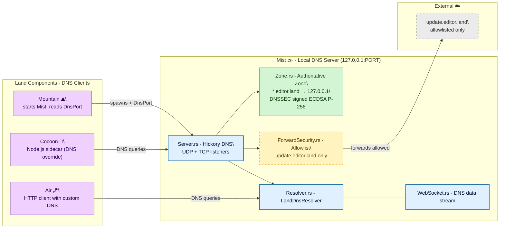

# **Mist**&#x2001;🌫️

<table>
	<tr>
		<td>
			<a href="https://GitHub.Com/CodeEditorLand/Mist" target="_blank">
				<picture>
					<source media="(prefers-color-scheme: dark)" srcset="https://img.shields.io/github/last-commit/CodeEditorLand/Mist?label=Last-commit&color=black&labelColor=black&logoColor=white&logoWidth=0" />
					<source media="(prefers-color-scheme: light)" srcset="https://img.shields.io/github/last-commit/CodeEditorLand/Mist?label=Last-commit&color=white&labelColor=white&logoColor=black&logoWidth=0" />
					
				</picture>
			</a>
			<br />
			<a href="https://GitHub.Com/CodeEditorLand/Mist" target="_blank">
				<picture>
					<source media="(prefers-color-scheme: dark)" srcset="https://img.shields.io/github/issues/CodeEditorLand/Mist?label=Issues&color=black&labelColor=black&logoColor=white&logoWidth=0" />
					<source media="(prefers-color-scheme: light)" srcset="https://img.shields.io/github/issues/CodeEditorLand/Mist?label=Issues&color=white&labelColor=white&logoColor=black&logoWidth=0" />
					
				</picture>
			</a>
		</td>
		<td>
			<a href="https://github.com/CodeEditorLand/Mist" target="_blank">
				<picture>
					<source media="(prefers-color-scheme: dark)" srcset="https://img.shields.io/github/stars/CodeEditorLand/Mist?style=flat&label=Star&logo=github&color=black&labelColor=black&logoColor=white&logoWidth=0" />
					<source media="(prefers-color-scheme: light)" srcset="https://img.shields.io/github/stars/CodeEditorLand/Mist?style=flat&label=Star&logo=github&color=white&labelColor=white&logoColor=black&logoWidth=0" />
					
				</picture>
			</a>
			<br />
			<a href="https://GitHub.Com/CodeEditorLand/Mist" target="_blank">
				<picture>
					<source media="(prefers-color-scheme: dark)" srcset="https://img.shields.io/github/downloads/CodeEditorLand/Mist?label=Downloads&color=black&labelColor=black&logoColor=white&logoWidth=0" />
					<source media="(prefers-color-scheme: light)" srcset="https://img.shields.io/github/downloads/CodeEditorLand/Mist?label=Downloads&color=white&labelColor=white&logoColor=black&logoWidth=0" />
					
				</picture>
			</a>
		</td>
	</tr>
</table>

DNS isolation for the editor.land private network.

> **Development environments that communicate over the public internet expose
> services to unnecessary risk. DNS resolution for local services goes through
> external resolvers, leaking information about the development setup.**
>
> _"Nothing leaks to the public internet. A clean network boundary between the
> editor and the outside world."_

[](https://github.com/CodeEditorLand/Mist/tree/Current/LICENSE)

**[Rust API Documentation](https://rust.documentation.mist.editor.land/)**&#x2001;📖

---

## Overview

**Mist** provides DNS isolation and private network resolution for the **Land**
Code Editor. It creates a secure DNS sandbox that resolves all `*.editor.land`
domains locally to `127.0.0.1`, ensuring that all private network communication
remains local and secure. External DNS queries are restricted to a strict
allowlist, preventing sidecars from accessing arbitrary external hosts.

Editor components need to discover each other on the private network, but
standard DNS resolution leaks queries to external resolvers. Mist solves this
by running a local authoritative DNS server for the `editor.land` zone —
every query stays on the machine, and nothing escapes to the public internet.

**Mist is engineered to:**

1. **Provide Private DNS Resolution** — Operate a local DNS server
   authoritative for the `editor.land` zone, resolving all subdomains to
   `127.0.0.1` for secure local communication.
2. **Enforce Forward Security** — Implement a forward allowlist that only
   permits DNS resolution to specific, trusted external domains (e.g.,
   `update.editor.land`).
3. **Support DNSSEC** — Sign the `editor.land` zone with ECDSA P-256 keys
   for DNSSEC, providing cryptographic assurance of DNS responses.
4. **Enable Sidecar Isolation** — Allow Node.js sidecars (like **Cocoon**) to
   use the local DNS server via a custom DNS override, ensuring they cannot
   access arbitrary external hosts.

---

## Key Features&#x2001;🔒

**Private DNS Zone** — Authoritative zone for `*.editor.land` domains. All
subdomains resolve to `127.0.0.1`, creating a fully isolated private network
for the editor's internal services. No DNS queries ever leave the machine.

**Forward Security** — Allowlist-based DNS forwarding prevents sidecars from
reaching arbitrary external hosts. Only explicitly trusted domains (such as
`update.editor.land`) can be resolved externally. All other queries are
refused by default.

**DNSSEC Signing** — The `editor.land` zone is signed with ECDSA P-256 keys,
providing cryptographic assurance of DNS responses. Clients can verify the
authenticity of every DNS record through `DNSKEY` and `RRSIG` records.

**Dynamic Port Allocation** — Automatically finds available ports using
`portpicker`, avoiding port conflicts with other services. Prefers a
configurable starting port and falls back to system-assigned ports when
needed.

**WebSocket Transport** — Real-time DNS data streaming over WebSocket for
local-first JSON-RPC communication between editor components. Supports
secure, low-latency message delivery within the private network.

**Loopback Binding** — The DNS server binds exclusively to `127.0.0.1`,
ensuring no external host can query the private DNS server. Combined with
the forward allowlist, this creates a complete network boundary.

---

## Core Architecture Principles&#x2001;🏗️

| Principle | Description | Key Components |
|-----------|-------------|----------------|
| **Network Isolation** | All `editor.land` DNS resolution stays local. The server binds to `127.0.0.1` only, and external queries require explicit allowlisting. | `Server`, `ForwardSecurity` |
| **Cryptographic Trust** | DNSSEC signing with ECDSA P-256 keys ensures DNS responses cannot be spoofed. Every zone record carries a verifiable signature. | `Zone`, `ring` DNSSEC operations |
| **Minimal Surface** | A flat module structure with no unnecessary abstractions. Each module has a single, well-defined responsibility with clear public APIs. | `Library`, `Server`, `Zone`, `Resolver` |
| **Composability** | Independent DNS resolver for use by other Land components. Any consumer can create a resolver pointed at the local DNS server without additional configuration. | `Resolver`, `LandDnsResolver` |

---

## System Architecture&#x2001;



**Connection paths:**

| Path | Protocol | Use Case |
|------|----------|----------|
| Mountain → Mist | Process spawn + port handoff | Application initialization, reads `DnsPort` managed state |
| Cocoon → Mist | DNS over UDP/TCP to `127.0.0.1` | Node.js sidecar DNS resolution for `editor.land` domains |
| Air → Mist | `LandDnsResolver` (Hickory client) | HTTP client DNS configured to use local resolver |
| Mist → External | UDP DNS (allowlisted only) | Forwarding queries for `update.editor.land` |

---

## Key Components

| Component | Path | Description |
|-----------|------|-------------|
| Library Entry | `Source/Library.rs` | Main library entry point, exports public API and manages DNS server state. |
| DNS Server | `Source/Server.rs` | DNS server implementation using Hickory, handles UDP/TCP listeners and catalog management. |
| Zone Configuration | `Source/Zone.rs` | DNS zone configuration for `editor.land`, including record definitions and authority creation. |
| DNS Resolver | `Source/Resolver.rs` | DNS resolver for use by other components, provides interface to the local DNS server. |
| Forward Security | `Source/ForwardSecurity.rs` | Forward allowlist management, restricts which external domains can be resolved. |
| WebSocket Transport | `Source/WebSocket.rs` | WebSocket transport layer for real-time DNS data streaming. |

---

## Project Structure&#x2001;🗺️

```
Element/Mist/
├── Source/
│   ├── Library.rs              # Library root, DNS server lifecycle
│   ├── Server.rs               # Hickory DNS server (UDP/TCP listeners)
│   ├── Zone.rs                 # Authoritative editor.land zone + DNSSEC
│   ├── Resolver.rs             # LandDnsResolver for consumer use
│   ├── ForwardSecurity.rs      # Allowlist-based forward DNS
│   └── WebSocket.rs            # JSON-RPC over WebSocket transport
├── tests/
│   └── integration.rs          # Integration test suite
└── Documentation/
    ├── GitHub/
    │   ├── Architecture.md     # Internal module design
    │   └── DeepDive.md         # In-depth technical details
    └── Rust/
        └── doc/                # Cargo doc output
```

---

## In the Land Project

**Mist** provides the DNS isolation that secures the Land private network. All
`*.editor.land` domains resolve to `127.0.0.1`, preventing external network
leakage. External DNS queries are restricted to a strict allowlist.

**Mist** is part of the networking/IPC connectivity stack alongside **Air** 🪁
(background daemon, uses Mist's DNS resolver for its HTTP client) and **Vine**
🍇 (gRPC protocol layer).

### Integration

| Consumer | How Mist is Used |
| :------- | :--------------- |
| **Mountain** ⛰️ | Starts the DNS server during application initialization and provides the port to other components via the `DnsPort` managed state. |
| **Air** 🪁 | Uses the DNS server for secure HTTP requests, configuring HTTP clients to use the local DNS resolver. |
| **SideCar** | Spawns Node.js sidecars with DNS override configuration, ensuring all DNS queries go through the local server. |
| **Cocoon** 🦋 | The Node.js extension host can resolve `editor.land` domains via the local DNS server for gRPC communication with Mountain. |

### DNS Zone Configuration

**Authoritative Zone: `editor.land`** — All subdomains of `editor.land` resolve
to `127.0.0.1`:

- `code.editor.land` → `127.0.0.1`
- `api.editor.land` → `127.0.0.1`
- `*.editor.land` → `127.0.0.1`

**Forward Allowlist** — Only allowlisted external domains can be resolved:

- `update.editor.land` — For application updates

All other external queries are refused by default.

**DNSSEC** — The `editor.land` zone is signed with ECDSA P-256 keys:

- `DNSKEY` records provide the public signing key
- `RRSIG` records provide cryptographic signatures
- Clients can verify the authenticity of DNS responses

---

## Getting Started&#x2001;🚀

### Prerequisites

- **Rust** 1.75 or later
- No system DNS configuration required — Mist binds to `127.0.0.1` only

### Build

```bash
cd Element/Mist
cargo build --release
```

### Test

```bash
# Run all tests
cargo test

# Run integration tests
cargo test --test integration

# Run with logging
RUST_LOG=debug cargo test
```

### As a Library

```rust
use Mist::start;

// Start on preferred port 5380
let Port = Mist::start(5380)?;

// Or let the system select an available port
let Port = Mist::start(0)?;

println!("DNS server running on 127.0.0.1:{}", Port);
```

### Creating a DNS Resolver

```rust
use Mist::resolver::{land_resolver, LandDnsResolver};

// Simple resolver
let Port = Mist::dns_port();
let Resolver = land_resolver(Port);

// Or with explicit interface
let Resolver = LandDnsResolver::new(Port);
```

### Dependencies

| Crate | Version | Purpose |
| :---- | :------ | :------ |
| `hickory-server` | `0.24` | DNS server implementation |
| `hickory-proto` | `0.24` | DNS protocol implementation |
| `hickory-client` | `0.24` | DNS client for resolvers |
| `ring` | `0.17` | Cryptographic signing for DNSSEC |
| `tokio` | `1.49` | Async runtime |
| `anyhow` | `1.0` | Error handling |
| `tracing` | `0.1` | Logging and instrumentation |
| `once_cell` | `1.21` | Thread-safe lazy initialization |
| `portpicker` | `0.1.1` | Random port selection |
| `async-trait` | `0.1` | Async trait support |
| `reqwest` | `0.13` | HTTP client with DNS integration |

---

## Security&#x2001;🔒

Mist enforces security at multiple layers:

| Layer | Mechanism |
|-------|-----------|
| **Network isolation** | All `editor.land` domains resolve to `127.0.0.1`, preventing any external network access for private services. |
| **Forward allowlist** | External DNS queries are restricted to a trusted allowlist, preventing sidecars from accessing arbitrary external hosts. |
| **DNSSEC** | Zone signing provides cryptographic assurance of DNS responses, preventing DNS spoofing attacks. |
| **Loopback binding** | The DNS server only binds to `127.0.0.1`, preventing external access to the private DNS server. |

---

## API Reference

- [Rust API Documentation](https://rust.documentation.mist.editor.land/)&#x2001;📖

---

## Related Documentation

- [Architecture Overview](https://github.com/CodeEditorLand/Mist/tree/Current/Documentation/GitHub/Architecture.md)
    — Internal module structure
- [Deep Dive](https://github.com/CodeEditorLand/Mist/tree/Current/Documentation/GitHub/DeepDive.md)
    — In-depth technical details
- [Land Documentation](../../Documentation/GitHub/README.md) — Complete
    documentation index
- **Air** 🪁 — Background daemon that consumes Mist for HTTP client DNS —
    [GitHub](https://github.com/CodeEditorLand/Air)
- **Vine** 🍇 — gRPC protocol layer —
    [GitHub](https://github.com/CodeEditorLand/Vine)
- **Mountain** ⛰️ — Main application process —
    [GitHub](https://github.com/CodeEditorLand/Mountain)

---

## Funding & Acknowledgements&#x2001;🙏🏻

This project is funded through
[NGI0 Commons Fund](https://NLnet.NL/commonsfund), a fund established by
[NLnet](https://NLnet.NL) with financial support from the European Commission's
Next Generation Internet program, under grant agreement No 101135429.

The project is operated by PlayForm, based in Sofia, Bulgaria. PlayForm acts as
the open-source steward for Code Editor Land under the NGI0 Commons Fund grant.

<table>
	<tbody>
		<tr>
			<td align="left" valign="middle">
				<a href="https://Editor.Land">
					
				</a>
			</td>
			<td align="left" valign="middle">
				<a href="https://PlayForm.Cloud">
					
				</a>
			</td>
			<td align="left" valign="middle">
				<a href="https://NLnet.NL">
					
				</a>
			</td>
			<td align="left" valign="middle">
				<a href="https://NLnet.NL/commonsfund">
					
				</a>
			</td>
		</tr>
	</tbody>
</table>

---

**Project Maintainers**: Source Open (Source/Open@editor.land) |
[GitHub Repository](https://github.com/CodeEditorLand/Mist) |
[Report an Issue](https://github.com/CodeEditorLand/Mist/issues) |
